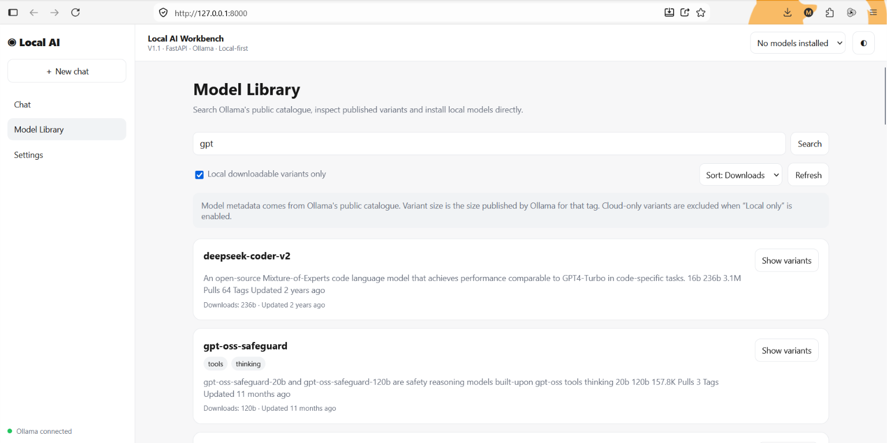
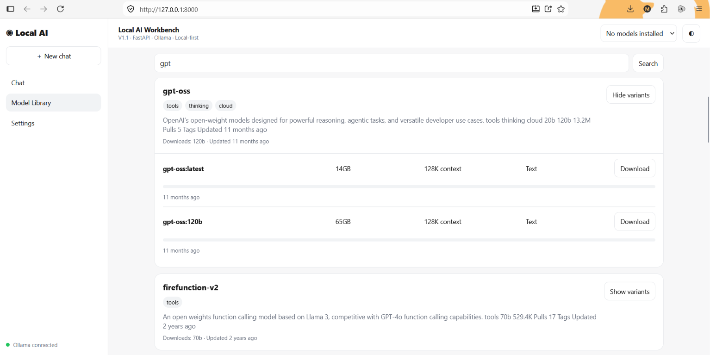
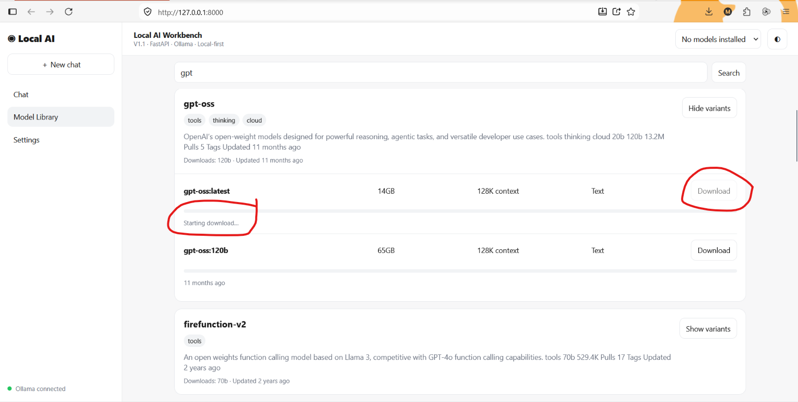

# Model Library

The **Model Library** provides a browser-based workflow for discovering
and installing models for the local Ollama runtime.

## Purpose

Instead of requiring users to know the exact `ollama pull` command in
advance, the Workbench can search Ollama's public model catalogue,
inspect a model family, discover its available tags/variants, and
initiate installation through the local Ollama service.

## Typical workflow

``` text
Search model family
       ↓
Inspect matching result
       ↓
Discover tags / variants
       ↓
Check published size and metadata
       ↓
Choose a locally downloadable variant
       ↓
Download through local Ollama
       ↓
Installed-state detection
       ↓
Model becomes available in Chat
```

## Search

Enter a model-family name in the Model Library search field, for
example:

``` text
gpt-oss
qwen
gemma
llama
deepseek
```

Search results depend on the information currently exposed by Ollama's
public catalogue.

## Variant discovery

A model family may provide several variants. Variants can differ in:

-   parameter count
-   quantization
-   artifact/download size
-   context window
-   input type
-   capabilities
-   local or cloud availability

Do not assume that two tags in the same family have the same hardware
requirements.

## Local-only filtering

V1.1 is designed around **local Ollama inference**. The Model Library
therefore filters out detected cloud-only variants when local-only
filtering is enabled.

The filtering is performed at the variant level where possible, rather
than assuming an entire model family is either local or cloud.

## Download-size information

When Ollama publishes a size for a detected variant, the Workbench
displays that published artifact size.

This is more useful than estimating disk requirements only from
parameter count because quantization and packaging can materially change
the actual artifact size.

Published size is still not a guarantee of runtime memory consumption.
RAM/VRAM requirements can be different from disk download size.

## Popularity and download counts

The Workbench displays popularity/download information when it can be
obtained from the public Ollama catalogue.

Treat this as discovery metadata, not as a quality score. A highly
downloaded model is not automatically the best model for a particular
workload.

## Installing a model

Choose a locally downloadable variant and select the download/install
action.

The request flows through:

``` text
WebUI
  ↓
FastAPI
  ↓
Ollama service
  ↓
Local Ollama /api/pull
```

Download progress is reported in the interface.

## Installed-state detection

The Workbench checks the local Ollama `/api/tags` endpoint to identify
models already installed on the machine.

After a successful installation, the Chat model selector is refreshed so
the newly installed model can be selected.

## Command-line alternative

Everything installed by the Workbench is still an Ollama model. You can
use Ollama directly:

``` powershell
ollama list
ollama pull <model:tag>
ollama rm <model:tag>
```

Use Ollama's own documentation before performing commands not covered by
the Workbench UI.

## Important limitations

The public Ollama website/catalogue is not the same interface as the
local Ollama API. V1.1 performs best-effort catalogue discovery from
public information.

Consequently:

-   public catalogue HTML or metadata may change
-   some fields may be absent
-   variant metadata can differ between families
-   search results may change over time
-   unknown or ambiguous variants should not be treated as safely
    downloadable merely because a family name was found

See [Limitations](limitations.md) for additional details.

## Screenshots

Recommended repository images:

``` markdown





```
