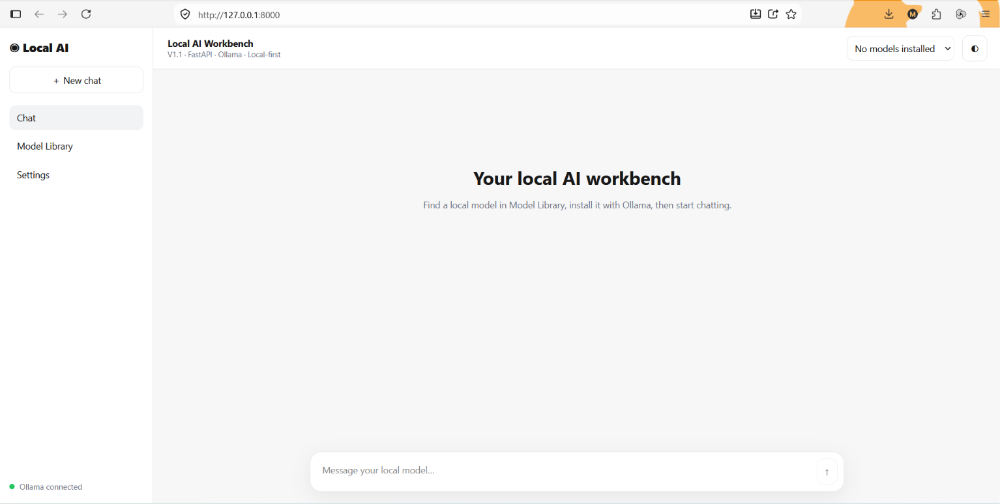
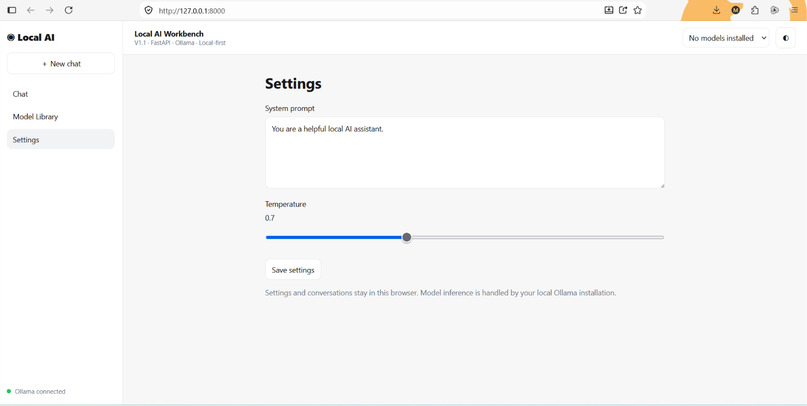

# Using Chat

The Chat page is the main inference interface in Local AI Workbench.

## Before chatting

Confirm that:

1.  Ollama is running.
2.  At least one local model is installed.
3.  The Workbench reports **Ollama connected**.
4.  The intended model appears in the model selector.

If the selector reports **No models installed**, use the Model Library
or `ollama pull` to install one.

## Select a model

Use the model selector in the application header.

The list is populated from models currently installed in your local
Ollama runtime. The application is deliberately model-agnostic; it does
not require a specific model family.

## Send a prompt

Enter a message in the composer and submit it.

The request follows this path:

``` text
Browser
   ↓
FastAPI
   ↓
LLM/Ollama service
   ↓
Local Ollama model
   ↓
Streaming response
   ↓
Browser
```

## First response may take longer

The first response after starting Ollama or loading a large model may take significantly longer than subsequent responses. This is typically cold-start/model-loading latency. Ollama may need to load model weights into system RAM and/or GPU VRAM before it can generate the first token. For example, a model around 12–14 GB can require noticeable startup time depending on available RAM, VRAM, GPU capability, and CPU fallback. Once the model remains loaded, subsequent prompts are normally faster.

## Streaming responses

Responses are streamed rather than waiting for the complete generation
before displaying output.

This provides faster perceived response time and creates a more natural
chat experience for slower local models.

## Stop generation

Use the stop-generation control when you want to terminate an
in-progress response from the browser.

The exact behavior of cancellation can depend on the request lifecycle
and Ollama runtime.

## New Chat

Use **New chat** to start a fresh conversation context in the interface.

V1.1 uses browser-side persistence for chat/UI state. It is not yet a
server-side conversation database.

## System prompt

The system prompt provides high-level instructions to the selected
model.

Examples include:

``` text
You are a concise Python programming assistant.
```

or:

``` text
You are an LLM engineering tutor. Explain concepts step by step and use examples.
```

Model compliance varies. A system prompt is an instruction to the model,
not an enforcement or security boundary.

## Temperature

Temperature influences sampling behavior.

In general:

-   lower values tend toward more deterministic output
-   higher values can increase variation
-   ideal settings depend on the model and task

Do not treat one temperature value as universally optimal.

## Local privacy

Inference with an installed local Ollama model is designed to run on the
local machine. However, V1.1's **Model Library search and model download
workflows can require internet access** to query public catalogue
information or retrieve model artifacts.

Review any future external tools, APIs, RAG sources, or integrations
separately before sending sensitive information through them.

## Conversation persistence

Current persistence is browser-oriented.

Implications:

-   browser storage is machine/browser specific
-   clearing site/browser storage may remove saved UI/chat state
-   conversations are not synchronized across devices
-   there is no user-account database in V1.1

Server-side conversation persistence is a possible future enhancement.

## Model output

Local models can hallucinate, make factual errors, produce insecure
code, or misunderstand instructions.

Always validate important outputs independently.

## Screenshots

Recommended repository images:

``` markdown




```
